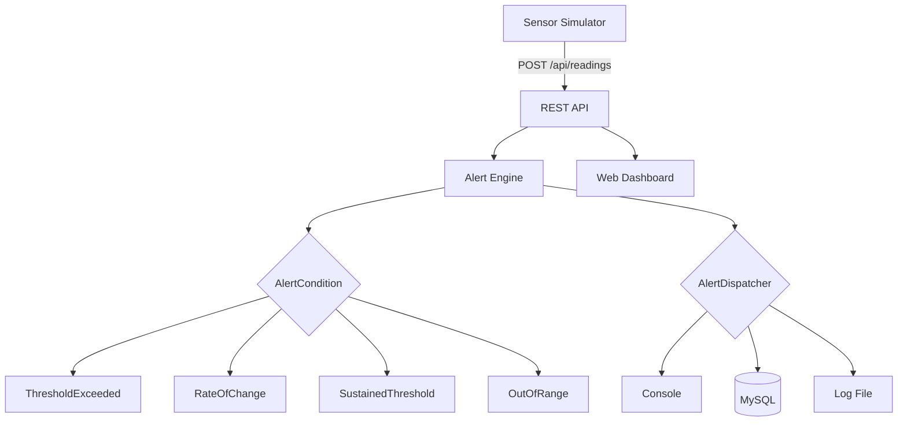
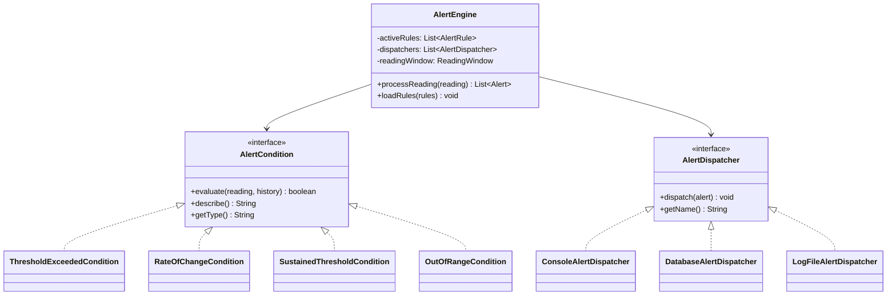

# Pason Threshold Alert Engine

A Java application that monitors real-time sensor data streams from drilling rigs, evaluates configurable alert rules against incoming readings, and dispatches alerts when thresholds are breached — built with clean OOP design patterns.

## Architecture



## Class Diagram — Design Patterns



## Tech Stack

| Technology | Version | Purpose |
|---|---|---|
| Java | 17 | Language |
| Spring Boot | 3.2.3 | Application framework |
| Spring Data JPA | 3.2.x | Database access |
| MySQL | 8.0 | Relational database |
| Flyway | 9.x | Database migrations |
| springdoc-openapi | 2.3.0 | Swagger/OpenAPI docs |
| JUnit 5 | 5.10.x | Testing framework |
| AssertJ | 3.25.x | Fluent test assertions |
| Mockito | 5.x | Test mocking |
| Gradle | 8.x | Build tool |
| Docker | - | Containerization |
| GitHub Actions | - | CI pipeline |

## Quick Start

```bash
# Clone and start with Docker Compose
git clone https://github.com/your-username/alert-engine.git
cd alert-engine
docker compose up --build

# The app is now running:
# Dashboard: http://localhost:8080
# Swagger UI: http://localhost:8080/swagger-ui.html
# API: http://localhost:8080/api

# Start the sensor simulator
curl -X POST http://localhost:8080/api/simulator/start
```

## Sensor Simulator

The built-in simulator generates realistic data for 5 drilling rig sensors:

| Sensor | Baseline | Unit | Anomaly Behavior |
|---|---|---|---|
| Pressure | 2500 | PSI | Spikes to 3600+ |
| Temperature | 200 | °F | Drifts to 280+ (sustained) |
| Flow Rate | 450 | GPM | Drops to 180 |
| Gas Level | 5 | %LEL | Spikes to 25+ |
| Rotary Speed | 100 | RPM | Drops to 20 |

## Default Alert Rules

8 pre-configured rules seeded via Flyway migration:

| Rule | Sensor | Condition | Severity |
|---|---|---|---|
| Critical Pressure Spike | PRESSURE | > 3500 PSI | CRITICAL |
| High Pressure Warning | PRESSURE | > 3000 PSI | WARNING |
| Rapid Pressure Change | PRESSURE | Rate > 100/sec | WARNING |
| Sustained High Temperature | TEMPERATURE | > 275°F for 30s | WARNING |
| Low Flow Rate | FLOW_RATE | < 250 GPM | WARNING |
| Flow Rate Out of Range | FLOW_RATE | Outside 200-700 | CRITICAL |
| High Gas Level | GAS_LEVEL | > 20 %LEL | CRITICAL |
| Rotary Speed Out of Range | ROTARY_SPEED | Outside 30-180 | WARNING |

## API Reference

Full Swagger UI available at `/swagger-ui.html` when the app is running.

| Method | Endpoint | Description |
|---|---|---|
| GET | `/api/rules` | List all alert rules |
| GET | `/api/rules/{id}` | Get rule by ID |
| POST | `/api/rules` | Create a new rule |
| PATCH | `/api/rules/{id}/toggle` | Enable/disable a rule |
| DELETE | `/api/rules/{id}` | Delete a rule |
| POST | `/api/readings` | Submit a sensor reading |
| GET | `/api/readings` | Get recent readings |
| GET | `/api/alerts` | Get recent triggered alerts |
| GET | `/api/engine/status` | Engine metrics |
| POST | `/api/simulator/start` | Start simulator |
| POST | `/api/simulator/stop` | Stop simulator |
| GET | `/api/simulator/status` | Simulator status |

## Project Structure

```
alert-engine/
  src/main/java/com/pason/alertengine/
    domain/
      model/           SensorReading, Alert, AlertRule, enums
      condition/        AlertCondition interface + 4 implementations
      dispatch/         AlertDispatcher interface + 3 implementations
    engine/
      AlertEngine      Core processing pipeline
      ReadingWindow    Sliding window for sensor history
    api/
      controller/      REST controllers
      dto/             Request/response DTOs
      exception/       Global exception handler
      service/         AlertRuleService
    persistence/
      entity/          JPA entities
      repository/      Spring Data repositories
    simulator/
      DrillingSensorSimulator, SensorProfile
    config/
      AppConfig, OpenApiConfig, StartupLoader
  src/main/resources/
    db/migration/      Flyway SQL migrations (V1-V4)
    static/            Web dashboard (HTML/CSS/JS)
  src/test/java/       25+ JUnit 5 tests
```

## Design Decisions

- **Strategy pattern for conditions** — New condition types can be added by implementing `AlertCondition` without modifying the engine (Open/Closed Principle).
- **Observer pattern for dispatchers** — New delivery channels (email, Slack, webhook) can be added by implementing `AlertDispatcher` without touching alert logic.
- **Immutable domain objects** — `SensorReading` and `Alert` use `final` fields with no setters, ensuring thread safety when processing concurrent sensor streams.
- **Flyway over JPA auto-DDL** — Version-controlled migrations ensure reproducible schema changes and are production-safe.
- **Strict inequality for thresholds** — Values exactly at the threshold are considered safe. This prevents alert storms when sensors oscillate at boundary values due to noise.
- **JPA entities separate from domain model** — The persistence layer uses its own entity classes mapped via `ConditionConfigMapper`, keeping the domain model clean and framework-independent.

## How to Add a New Condition Type

1. Create a new class implementing `AlertCondition` in `domain/condition/`
2. Implement `evaluate()`, `describe()`, and `getType()`
3. Add deserialization support in `ConditionConfigMapper.deserializeCondition()`
4. Add serialization support in `ConditionConfigMapper.serializeCondition()`
5. Write tests with parameterized boundary cases
6. Create rules via the REST API using your new condition type

## Running Tests

```bash
# Run all tests with coverage report
./gradlew test jacocoTestReport

# View coverage report
open build/reports/jacoco/test/html/index.html

# Run checkstyle
./gradlew checkstyleMain checkstyleTest

# Run everything
./gradlew check
```

## License

MIT
